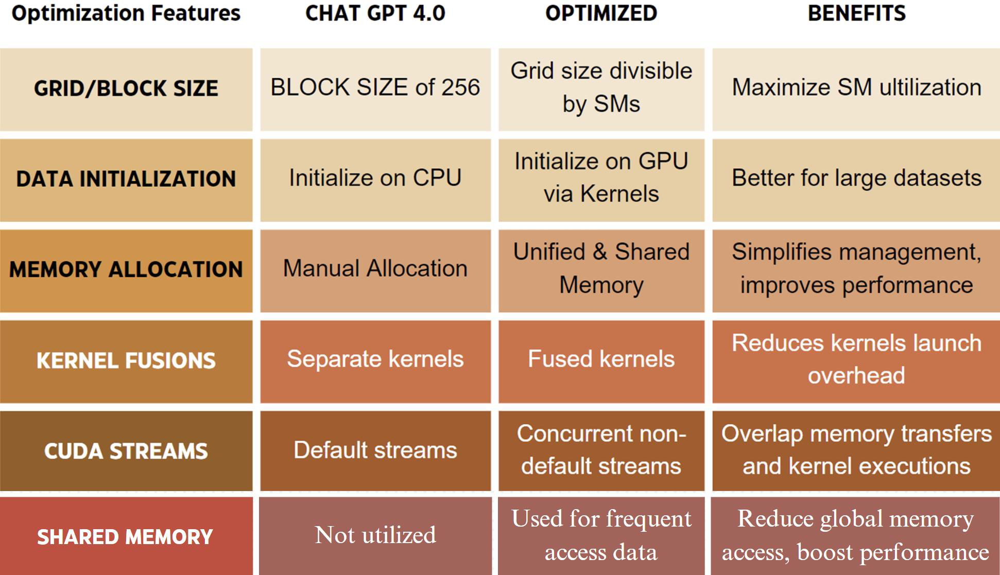
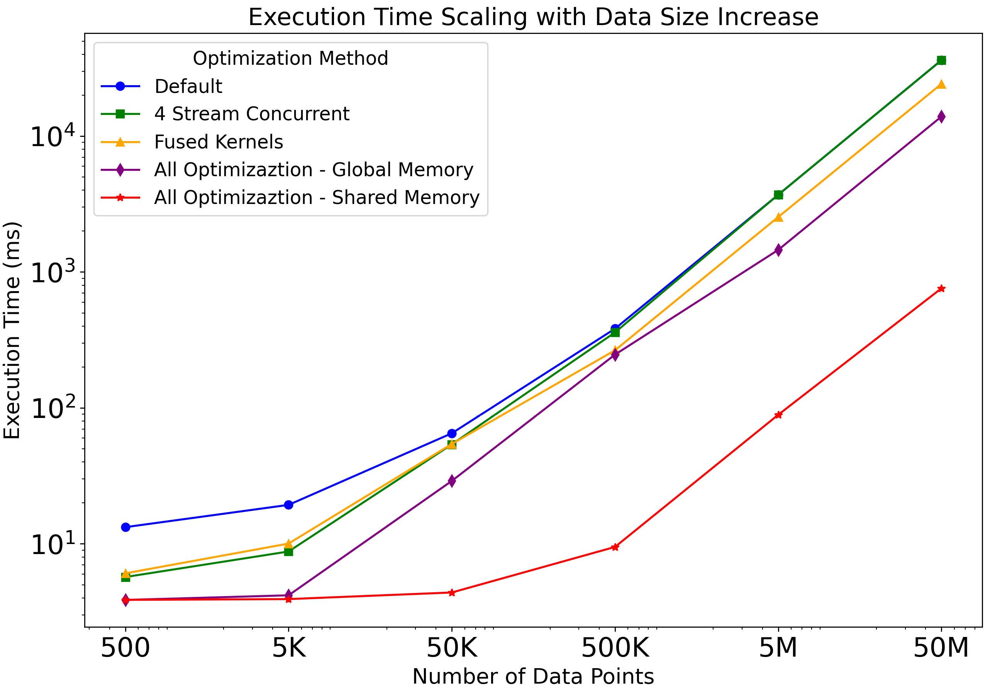
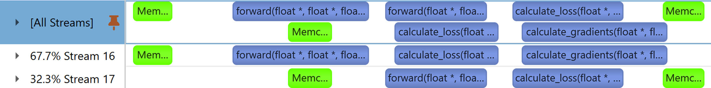
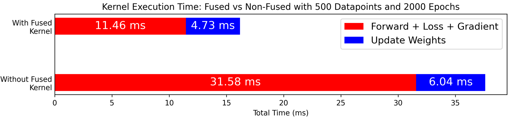
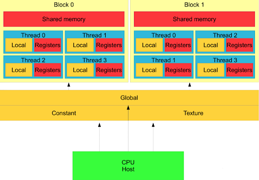

# Phase 2: Initial CUDA ML Models from LLMs

The goal of this phase is to implement a linear regression model to predict an output `y` given input `X` using the formula: `y = w * X + b`, where `w` is the weight and `b` is the bias.

This phase focuses on the performance analysis of a simple regression task implemented in CUDA. The initial implementation was generated using ChatGPT and subsequently manually optimized to enhance execution time and accuracy. This README outlines the project structure, methodology, and results from the optimization process.

## Raw Model Features

- **CUDA Kernels**: Implements key operations including the forward pass, loss calculation, gradient computation, and weight updates for linear regression.
- **Training Loop**: Runs for 200 epochs, applying gradient descent to update model parameters and outputs training/testing loss every 10 epochs.
- **Parallelism**: Leverages CUDA’s parallel execution to efficiently handle large datasets by splitting tasks across multiple threads.
- **Memory Management**: Allocates and manages device memory for inputs, predictions, parameters, and gradients. Uses CUDA events to measure and report training time.
- **Loss Function**: Utilizes Mean Squared Error (MSE) L2loss for loss calculation.
- **Performance Profiling**: Includes CUDA events and `NVIDIA NSight System` to measure execution time, providing insights into the model's training efficiency.

### Refer to the [CUDA Code Implementation Folder](./cuda_models/) for details on how the CUDA model is structured and set up.

## Optimizations Applied

A series of optimizations were applied to the initial regression model generated by ChatGPT, focusing on improving memory management and computational efficiency. Below is a breakdown of the key techniques that significantly improved execution time:



The optimizations significantly improved the model's performance, reducing execution time and improving efficiency. The following graph illustrates the impact of these optimizations on execution time:



### Showcase of Optimization Techniques

Below are key techniques that significantly improved execution time:

- **CUDA Streams**: Multiple CUDA streams were used to allow concurrent memory transfers and kernel execution, reducing idle times and improving throughput.

  - **Implementation Details**: The data was split into multiple streams. While one stream was responsible for copying a segment of data from the host to the device, the other stream could simultaneously perform the training process on another segment. This approach effectively reduced idle times and improved throughput. 
  - **Results**: As shown in the profiling image, the forward pass does not have to wait for the completion of the previous training segment. Instead, it occurs concurrently across the two streams, significantly reducing the overall execution time.

  

- **Fused Kernels**: Several training operations were combined into a single kernel to minimize the overhead of launching multiple kernels and maximize data used in one pass.

  - **Implementation Details**: Instead of launching separate kernels for the forward pass, loss calculation, and gradient computation, these operations were fused into a single kernel. This fusion minimized the number of kernel launches, which is particularly beneficial in scenarios with many small operations that can be combined on the same chunk of data as in this case, the data is only needed to load into memory once.
  - **Results**: The fused kernels demonstrated a marked improvement in execution time, as fewer kernel launches translate to reduced overhead and better use of the GPU’s resources.

  

- **Shared Memory**: By utilizing shared memory for storing intermediate values such as input X, true output y_true, and gradients, the overhead of repeatedly accessing global memory during training was reduced.

  - **Implementation Details**:  Shared memory was initialized using the ```__shared__``` keyword, allowing data to be loaded at the start of the kernel execution. This enabled threads within each block to reuse the data efficiently. Synchronization between threads was handled with ```__syncthreads()``` to ensure correct execution order.
  - **Results**: The use of shared memory minimized global memory accesses, resulting in a significant speedup, despite the minor overhead introduced by thread synchronization. As shown in the graph, shared memory provided one of the largest performance improvements, especially for larger datasets where repeated global memory accesses would have introduced delays.

<p align="center">
  
</p>

Shared memory is faster than global memory and can be accessed by all threads in a block, allowing efficient data sharing and faster execution. Threads use it to share data efficiently, reducing the need to access slower global memory. Each thread has private registers, and shared memory allows quick data exchange between them. This speeds up performance, especially in tasks where multiple threads need to reuse data.

## Conclusions

The optimizations applied to this linear regression model significantly improved training time, but more complex models will require further refinement for both performance and accuracy. One notable limitation is the quality of code generated by Large Language Models (LLMs). While LLMs like ChatGPT can create initial CUDA implementations, they often lack the necessary depth in areas such as kernel fusion, memory management, and parallelization, leading to performance bottlenecks.

Additionally, LLM-generated code tends to be inconsistent, requiring manual debugging and optimization to ensure it works efficiently, especially when dealing with larger or more complex models.

### Limitations of LLM-Generated Code:
- **Optimization & Scalability**: LLMs struggle with advanced kernel and memory management optimizations, and face scalability issues as models grow more complex.
- **Manual Intervention**: The code often requires significant manual effort for debugging, optimization, and fine-tuning to achieve desired performance levels.

## Future Work

The next phases will focus on scaling to more complex models (e.g., neural networks) and larger datasets. The goal is to address the limitations of LLM-generated code through manual optimizations and explore ways to automate optimization for more intricate models. Tools like Nsight Systems will be employed to fine-tune GPU performance.

Although LLMs offer a solid starting point, manual intervention remains essential for optimizing CUDA-accelerated machine learning tasks.