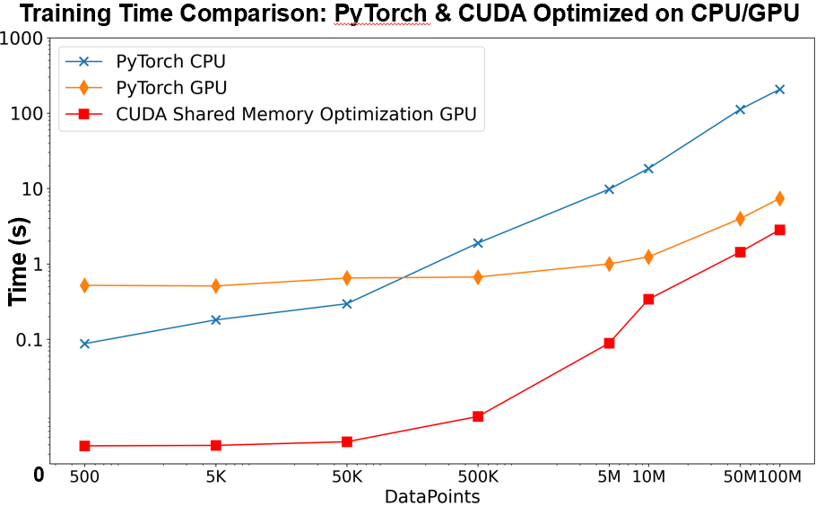
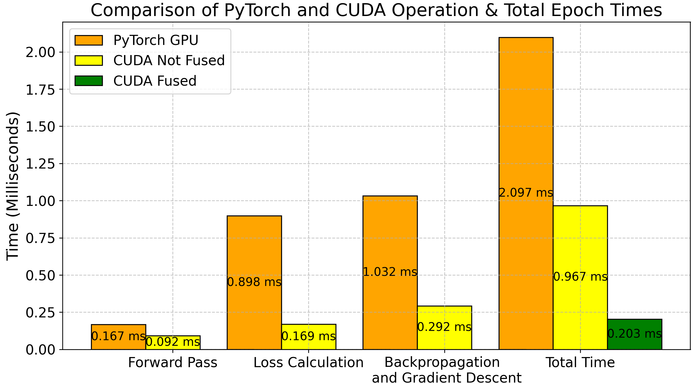

# Phase 3: Performance Comparison for PyTorch and CUDA Simple ML Models

## Overview

This phase focuses on comparing the performance of an optimized CUDA implementation of a linear regression model with its PyTorch counterpart. Both models aim to predict an output `y` given an input `X` using the formula: `y = w * X + b`, where `w` is the weight and `b` is the bias. The goal of this comparison is to analyze the speed and efficiency of both approaches in terms of execution time, scalability, and overall performance when handling various dataset sizes.

The key metrics of comparison include:
- **Execution Time**: The time taken to complete the forward pass, loss calculation, and backpropagation.
- **Scalability**: How each implementation handles increasing dataset sizes.
- **Efficiency**: The computational efficiency when utilizing GPU resources for individual training operations.

## Methodology

### High-Level Model Design 

- Both the PyTorch and CUDA implementations were designed with identical setups to ensure a fair comparison. They share the same hyperparameters, neural network design, input-output structure, train-test split, and manual initialization (via `manual_seed` for weight and bias). Additionally, both models use the same number of epochs, loss function (L2 Mean Squared Error Loss), and optimizer (Stochastic Gradient Descent - SGD). 

- The only difference between the two is the low-level optimizations applied in CUDA, which are not achievable in PyTorch due to its reliance on built-in, higher-level optimizations.

### Profiling

#### CUDA Profiling with NVIDIA Nsight Systems

For CUDA profiling, NVIDIA Nsight Systems was used with the following command:

```bash
nsys profile --stats=true -o report_file ./executable
```

This generates a detailed `report_file.nsys-rep` that can be opened and analyzed in NVIDIA Nsight Systems, allowing for examining the sequence of CUDA kernels, memory transfers, and other operations, providing insights into performance bottlenecks. Below is an zoom-in snapshot of 1 epoch.

[NSIGHT](./images/nvidia_system_sample.png)

#### PyTorch Profiling with PyTorch Profiler and Perfetto UI

For the PyTorch implementation, the PyTorch Profiler was used to generate a `trace.json` file. This trace file can be examined in Chrome's Trace Viewer (chrome://tracing) or Perfetto UI - Open Trace File (https://ui.perfetto.dev/). These tools allow for in-depth analysis of the profiled operators and CUDA kernels, giving a detailed view of the model's execution timeline. Below is an zoom-in snapshot of 1 epoch.

[Perfetto UI](./images/perfetto_ui_sample.png)

### Detailed Model Implementation

#### 1. **PyTorch Model** [View Source Code](./pytorch_model/regression.py)

- **Implementation**: A simple linear regression model using `nn.Linear` was built in PyTorch. Initial weights (`w = 0.83`) and bias (`b = 0.7645`) were manually set to match the CUDA model.

- **Data**: The dataset was created using `y = w * X + b`, with `X` ranging from 0 to 10 and a step size of 0.000002. It was split into 80% training and 20% testing data with a total of 5M datapoints.

- **Loss Function and Optimizer**: Mean Squared Error (MSE) was used as the loss function, and Stochastic Gradient Descent (SGD) with a learning rate of 0.01 was the optimizer.
  
- **Training**: The model was trained for 200 epochs on CPU or GPU (device agnostic). Each epoch included a forward pass, loss calculation, backpropagation, and optimizer step. Loss was printed every 10 epochs.

- **Performance**: The total training time was measured and reported in milliseconds for comparison with the CUDA model. Final model parameters were also printed after training.

#### 2. **Optimized CUDA Model** [View Source Code](./cuda_optimized_model/regression_optimized.cu)

- **Implementation**: The CUDA model was designed to leverage low-level optimizations by manually managing memory and operations to achieve better performance compared to PyTorch’s high-level API, utilizing the optimized CUDA model from the [Shared Memory Model](../cuda-ml-optimized/cuda_models/shared_mem_all/regression_shared_mem.cu).

- Several optimizations ([See Phase 2](../cuda-ml-optimized/)) were applied to improve performance, including:
  - **Fused Kernels**: By combining forward pass, loss calculation, and gradient computation into a single kernel, overhead from multiple kernel launches was minimized, leading to better GPU utilization.
  - **Shared Memory**: By loading key variables into shared memory, the model reduced global memory access bottlenecks, speeding up training.
  - **CUDA Streams**: Multiple CUDA streams allowed for concurrent execution of different tasks, improving throughput and reducing idle times.

- **CUDA Kernels**:
  - **Data Initialization**: A custom kernel (`initialize_data`) generates synthetic data based on the formula `y = w * X + b`, with added noise using random numbers generated by `curand`. This data is then loaded onto the GPU for training.
  - **Fused Kernels**: A fused kernel (`fused_kernel`) is used to combine forward pass, loss calculation, and gradient computation into a single operation, reducing kernel launch overhead. The kernel leverages **shared memory** to store intermediate values (`X`, `y_true`, gradients), minimizing slower global memory accesses.
  - **Weight Updates**: The `update_weights` kernel is responsible for updating the model parameters (`w` and `b`) using gradient descent after each training step.

- **Training Loop**: The model trains over 200 epochs. Each epoch runs the fused kernel across multiple streams, followed by the `update_weights` kernel to adjust `w` and `b`. Memory operations and kernel executions are done asynchronously to maximize efficiency.
  
- **Performance Measurement**: CUDA events measure total training time in milliseconds. The final weights, bias, test loss, and training time are printed for analysis.

- **Memory Management**: Memory for inputs, gradients, and model parameters is allocated and freed manually on the GPU using `cudaMalloc` and `cudaFree` to optimize resource use.


## Results

### 1. **Execution Time Comparison**
The following graph compares the training times for both PyTorch (on CPU and GPU) and the CUDA optimized model for varying dataset sizes, all models were run with 200 epochs:



- **PyTorch CPU**: Shows slower training times as the dataset size increases.
- **PyTorch GPU**: Provides better scalability but remains slower than the CUDA implementation.
- **CUDA Optimized Model (Shared Memory)**: Outperforms PyTorch GPU implementations, showcasing lower training times across all dataset sizes, especially with larger datasets where it excels in parallelism.

### 2. **Individual Operations Timing**
The graph below breaks down the time taken for each key operation (forward pass, loss calculation, backpropagation) for 1 epoch using 5M datapoints:



- **CUDA Fused Kernels**: Demonstrates superior performance in all operations, particularly in backpropagation and gradient descent, where it significantly reduces execution time.
- **PyTorch GPU**: Performs reasonably well but is outpaced by CUDA, especially for the loss calculation and total time per epoch.
- **CUDA Not Fused**: While improved over PyTorch, it’s still slower than the fused kernel approach, highlighting the importance of kernel fusion for optimization.

### 3. **Summary of Results**
- **Custom CUDA Implementation**: 
  - Achieves faster training times by optimizing at the kernel level, allowing greater control over memory management and execution flow.
  - Outperforms PyTorch in training speed and individual operations, especially with larger datasets.
  - However, the implementation is more complex and requires manual fine-tuning.
  
- **PyTorch Implementation**: 
  - While slower than the CUDA implementation, PyTorch offers higher-level optimizations and easier scalability for general use cases.
  - It’s more user-friendly and flexible, making it ideal for scenarios where rapid development and scalability are needed, without the need for low-level optimizations.

## Conclusion

The results show that a custom CUDA implementation can outperform PyTorch in execution time, particularly for larger datasets, due to manual optimizations at the kernel level. However, PyTorch offers ease of use, flexibility, and built-in optimizations that make it more accessible for general machine learning tasks. Depending on the use case, there is a trade-off between speed (CUDA) and development efficiency (PyTorch).