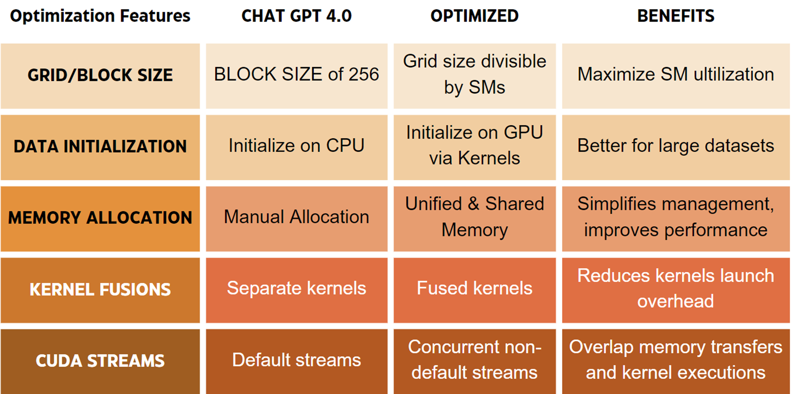
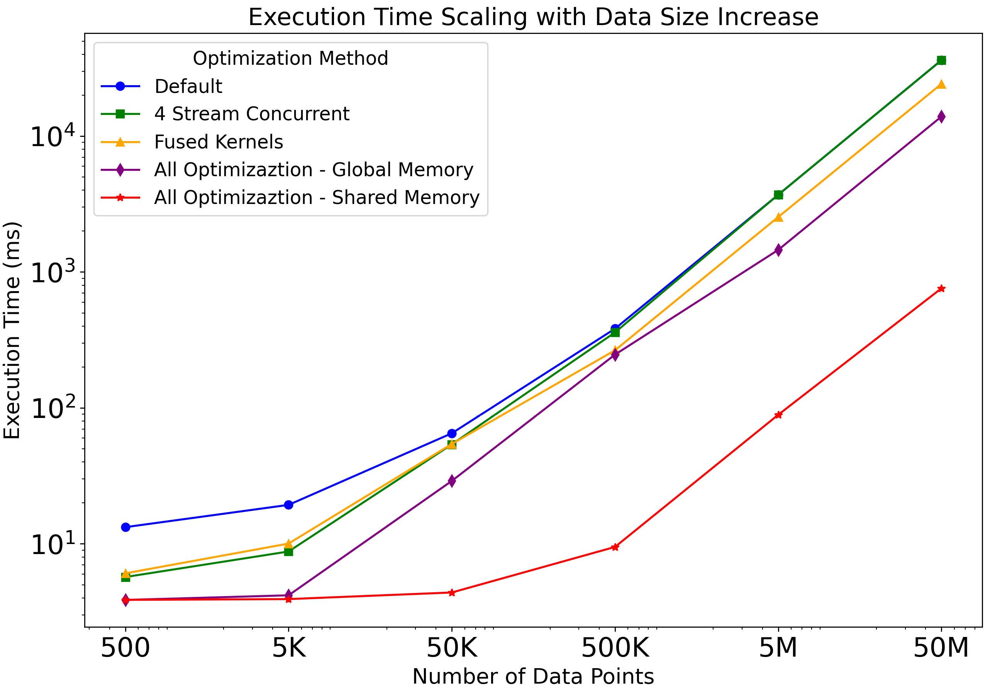
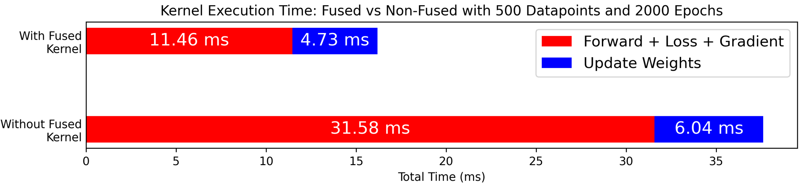
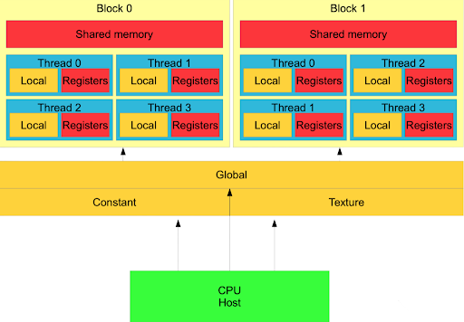

# Phase 2: Initial CUDA ML Models from LLMs

The goal of this phase is to implement a linear regression model to predict an output `y` given input `X` using the formula: `y = w * X + b`, where `w` is the weight and `b` is the bias.

This phase focuses on the performance analysis of a simple regression task implemented in CUDA. The initial implementation was generated using ChatGPT and subsequently manually optimized to enhance execution time and accuracy. This README outlines the project structure, methodology, and results from the optimization process.

## Raw Model Features

- **CUDA Kernels**: Implements key operations including the forward pass, loss calculation, gradient computation, and weight updates for linear regression.
- **Training Loop**: Runs for 200 epochs, applying gradient descent to update model parameters and outputs training/testing loss every 10 epochs.
- **Parallelism**: Leverages CUDA’s parallel execution to efficiently handle large datasets by splitting tasks across multiple threads.
- **Memory Management**: Allocates and manages device memory for inputs, predictions, parameters, and gradients. Uses CUDA events to measure and report training time.
- **Loss Function**: Utilizes Mean Absolute Error (MAE) for robust loss calculation.
- **Performance Profiling**: Includes CUDA events to measure execution time, providing insights into the model's training efficiency.

## Optimizations Applied

A series of optimizations were applied to the initial regression model generated by ChatGPT. These optimizations targeted both memory management and computational efficiency to improve the overall performance of the CUDA implementation. Below is a breakdown of each optimization technique:

The optimizations significantly improved the model's performance, reducing execution time and improving efficiency. The following graph illustrates the impact of these optimizations on execution time:

### Showcase of Optimization Techniques

Below are some of the showcase for important techniques that mostly increased the execution time ... (revise this)

- **CUDA Streams**: This optimization involved utilizing multiple CUDA streams to enable concurrent memory transfers and kernel execution. By overlapping data processing with non-blocking, segmented transfers, the model was able to process different segments of data simultaneously. 

  - **Implementation Details**: The data was split into two streams. While one stream was responsible for copying a segment of data from the host to the device, the other stream could simultaneously perform the training process on another segment. This approach effectively reduced idle times and improved throughput. 
  - **Results**: As shown in the profiling image, the forward pass does not have to wait for the completion of the previous training segment. Instead, it occurs concurrently across the two streams, significantly reducing the overall execution time.

  

- **Fused Kernels**: Kernel fusion was applied to reduce the overhead associated with launching multiple kernels for different operations. By combining several operations into a single kernel, the launch overhead was minimized, leading to faster execution and improved GPU efficiency.

  - **Implementation Details**: Instead of launching separate kernels for the forward pass, loss calculation, and gradient computation, these operations were fused into a single kernel. This fusion minimized the number of kernel launches, which is particularly beneficial in scenarios with many small operations that can be combined.
  - **Results**: The fused kernels demonstrated a marked improvement in execution time, as fewer kernel launches translate to reduced overhead and better use of the GPU’s resources.

  

- **Shared Memory**: Shared memory is significantly faster than global memory because it is located closer to the CUDA cores and is accessible within each block. By utilizing shared memory for storing intermediate values such as input X, true output y_true, and gradients, the overhead of repeatedly accessing global memory during training was reduced.

  - **Implementation Details**:  Shared memory was initialized using the __shared__ keyword, allowing data to be loaded at the start of the kernel execution. This enabled threads within each block to reuse the data efficiently. Synchronization between threads was handled with __syncthreads() to ensure correct execution order.
  - **Results**: The use of shared memory minimized global memory accesses, resulting in a significant speedup, despite the minor overhead introduced by thread synchronization. As shown in the graph, shared memory provided one of the largest performance improvements, especially for larger datasets where repeated global memory accesses would have introduced delays.

This diagram shows how shared memory in CUDA works. Shared memory is faster than global memory and can be accessed by all threads within a block. Threads use it to share data efficiently, reducing the need to access slower global memory. Each thread has private registers, and shared memory allows quick data exchange between them. This speeds up performance, especially in tasks where multiple threads need to reuse data.

### Insights and Future Work

While simple ML models like this linear regression can benefit from increased epochs to improve accuracy, more complex models require careful tuning and optimization, which may not be fully achievable through automatic generation by LLMs. Therefore, the focus in this phase has been on optimizing training time rather than solely improving accuracy.

Future work will involve scaling up the problem to more complex models and datasets, where both accuracy and efficiency will be evaluated and optimized.

This phase demonstrates the potential of CUDA for accelerating machine learning tasks, but also highlights the importance of manual optimization in achieving the best performance.
