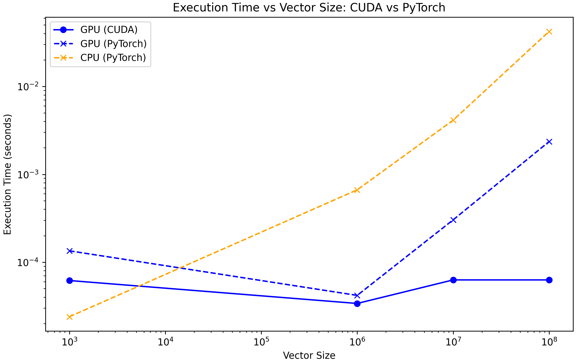

# Vector Addition: CUDA vs. PyTorch Performance Comparison

This folder contains a comparison of vector addition performance using CUDA and PyTorch on both CPU and GPU. The purpose is to evaluate the execution time differences across various vector sizes and demonstrate the speedup achieved by leveraging GPU acceleration with CUDA.

## Results

### Analysis

The graph above compares the execution times of vector addition implemented using CUDA (GPU) and PyTorch (on both CPU and GPU) across different vector sizes:

- **CUDA (GPU)**: Consistently shows the lowest execution time across all vector sizes, demonstrating the efficiency of CUDA for parallel processing tasks on the GPU using multiple threads.
- **PyTorch (GPU)**: Performance is better than CPU-based execution, but it still lags behind the custom CUDA implementation. This could be due to the overhead associated with PyTorch's higher-level abstractions.
- **PyTorch (CPU)**: Exhibits the highest execution times, particularly as vector sizes increase. This highlights the limitations of CPU processing for large-scale vector operations compared to GPU acceleration.

Overall, the CUDA implementation outperforms both PyTorch on GPU and CPU, especially for larger vector sizes, showcasing the advantages of CUDA's lower-level control over GPU resources.