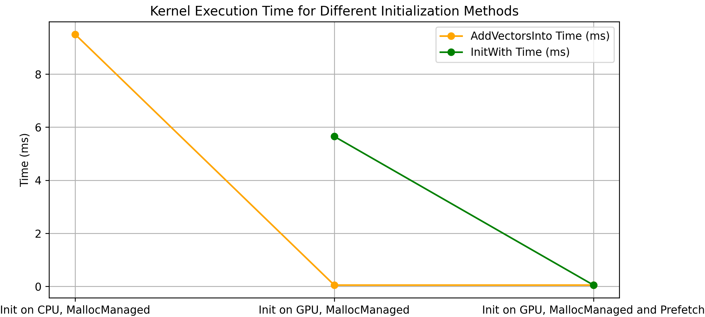
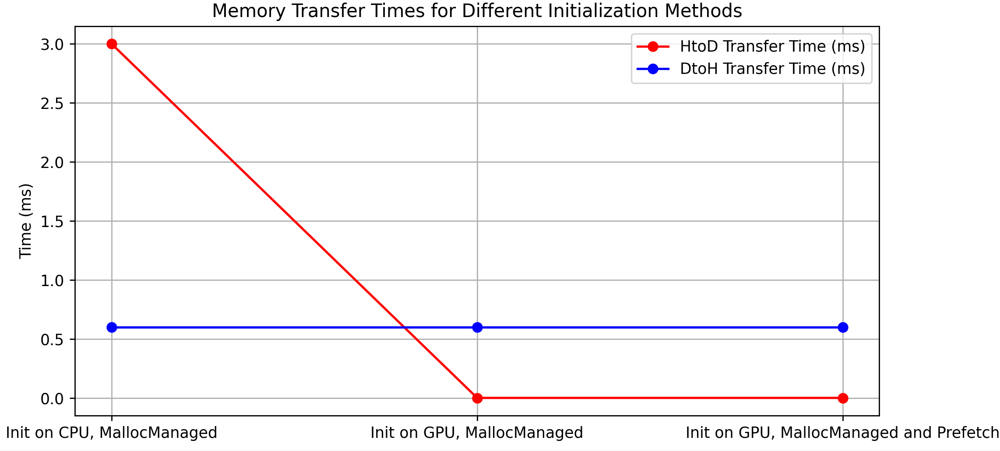

# CUDA Vector Addition Optimization

- This folder explores various optimization techniques for performing vector addition using CUDA.  
- The main goal is to understand and optimize the performance of a CUDA-based vector addition program by experimenting with different memory management techniques and initialization strategies. 

## Code Overview

The vector addition involves initializing vectors, performing the addition on the GPU, checking the results on the CPU, and then freeing the allocated memory. The project focuses on how different memory management and initialization strategies affect performance, particularly in the context of CUDA's unified memory (`cudaMallocManaged`).

1. **Initialization on the CPU using `cudaMallocManaged` - [(view source code)](./vector_add_UM.cu).**
2. **Initialization on the GPU using `cudaMallocManaged` - [(view source code)](./vector_add_init_kernel.cu).**
3. **Initialization on the GPU using `cudaMallocManaged` and `cudaMemPrefetchAsync` - [(view source code)](./vector_add_init_kernel_prefetch.cu).**
4. **Using Non-default Concurrent Streams for Overlapping Memory Transfers and Computation with `cudaMemcpyAsync`** - [(view source code)](./overlap_xfer.cu).

## Key Observations

Each subsequent technique builds upon the previous one, adding further optimizations:

**1. Initialization on GPU:** 
  - Faster than initialization on the CPU because there’s no need to wait for Host-to-Device (HtoD) memory transfers.
  - Kernel execution is faster since the data is already on the GPU.
  - This method scales well with larger datasets.

**2. Prefetching**
  - Prefetching memory to the GPU using `cudaMemPrefetchAsync` results in a significant reduction in initialization kernel execution time.
  - This approach avoids waiting for data to be transferred from unified memory to the device during kernel execution, leading to much faster kernel launches.
 
**3. Using Non-default Concurrent Stream**:
  - By using non-default streams with `cudaMemcpyAsync`, memory transfers can be overlapped with kernel execution, allowing segments of data to be processed concurrently while other segments are still being transferred.
  - This technique enhances efficiency by enabling work on data to begin immediately without waiting for the entire memory transfer progress to complete.

## Performance Analysis

The performance was measured in terms of kernel execution time and memory transfer time. Below are the results based on different initialization methods:

### Kernel Execution Time

#### AddVectorsInto: 
  - The time taken by the `AddVectorsInto` kernel is significantly reduced when the data is initialized on the GPU. In the CPU initialization scenario, the kernel execution takes longer as the data needs to be transferred from the CPU to the GPU before the addition can take place.
  - When initialization is done on the GPU, the execution time for `AddVectorsInto` drops sharply because the data is already on the GPU, ready for processing.

#### InitWith:
  - The `InitWith` kernel takes longer when the data is initialized on the GPU using `cudaMallocManaged` without prefetching. This is because, even though the data is in unified memory, it may not yet be physically present on the GPU, causing delays as data is transferred.
  - With `cudaMemPrefetchAsync`, the `InitWith` time is almost negligible because the data is already preloaded into the GPU memory, eliminating any wait time.

### Memory Transfer Times

#### HtoD Transfer Time:
  - Host-to-Device transfer time is a significant factor when initializing on the CPU. Since the data needs to be moved from the host (CPU) to the device (GPU), this introduces additional overhead.
  - In the GPU-based initialization methods, the HtoD transfer time is eliminated because the data is already on the GPU, hence no transfer is necessary.

#### DtoH Transfer Time:
  - Device-to-Host transfer time remains consistent across all methods because the data is always checked on the CPU after the computation. This operation doesn't change regardless of where the data was initially located or how it was managed.

### Using Non-default Concurrent Streams
  

This image highlights the difference between sequential and concurrent operations.

- The total kernel execution and memory transfer time for this technique, which introduces concurrent streams, is similar to the prefetch techniques.
- However, because memory transfers and kernel executions are overlapped, the total runtime of the application is significantly reduced. 

## Conclusion

This project demonstrates the critical role of memory management and execution strategies in optimizing CUDA programs:

- **GPU-based Initialization**: Significantly improves performance by eliminating the need for Host-to-Device (HtoD) memory transfers.
- **Prefetching**: Further reduces kernel execution time by ensuring data is already available on the GPU before computation begins.
- **Concurrent Streams**: Allows overlapping memory transfers and kernel execution, maximizing GPU utilization and reducing overall application runtime.

These optimizations are particularly beneficial for larger datasets, where memory transfer overheads and inefficient execution can significantly impact performance. As the project moves towards working with larger datasets and more complex model training applications, understanding and applying these techniques becomes increasingly important for achieving optimal performance.

## Future Work

- **Experiment with Larger Datasets**: Further explore the scalability of these optimizations with even larger datasets to understand their impact on performance.
- **Investigate Additional CUDA Memory Management Techniques**: Compare the performance of other CUDA memory management strategies to identify further opportunities for optimization.
- **Explore Advanced CUDA Features**: Delve into more advanced CUDA features, such as dynamic parallelism and cooperative groups, to push the boundaries of performance optimization.

Gaining proficiency in these optimization techniques is essential as we continue to scale up to larger datasets and tackle more demanding model training tasks. This knowledge will be crucial in ensuring that our applications run efficiently and effectively on modern GPU hardware.

## References
- Codes was learned and used from [NVIDIA DLI Course: Getting Started with Accelerated Computing in CUDA C/C++](https://learn.nvidia.com/courses/course-detail?course_id=course-v1:DLI+S-AC-04+V1)

